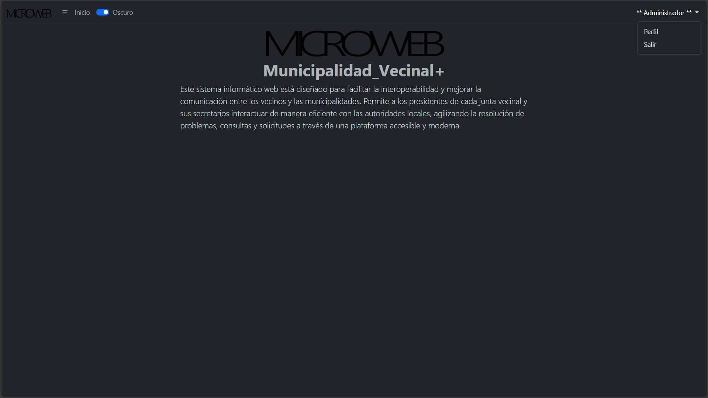

# SIMU 🌐
## Sistema Informatico Municipal

**Descripción:**
Este sistema informático web está diseñado para facilitar la interoperabilidad y mejorar la comunicación entre los vecinos y las municipalidades.

### Características Principales
- **Integracion Biblioteca Publica**: Facilita el acceso a la literatura publica.
- **Agenda Medica**: Menores de edad y mayores de edad podran solicitar reservar hrs medicas por medios online.
- **Agenda departamento del transito**: Al igual que la agenda medica, todos los usuarios pueden reservar previamente atencion para dichos servicios proporcionados por este establecimiento publico.
- **Pago de contribuciones y otros**: Todos los ciudadanos podran pagar, partes, permisos patentes de forma onlinea.

### Tecnologías Utilizadas

|N°| Caracteristica | Detalles |
| | --------- | --------- |
| | Integracion Biblioteca Publica    | Facilita el acceso a la literatura publica.    |
| | Agenda Medica    | Menores de edad y mayores de edad podran solicitar reservar hrs medicas por medios online.    |
| | Agenda departamento del transito    | Al igual que la agenda medica, todos los usuarios pueden reservar previamente atencion para dichos servicios proporcionados por este establecimiento publico.    |
| | Pago de contribuciones y otros    | Todos los ciudadanos podran pagar, partes, permisos patentes de forma onlinea.    |

- [Bootstrap](https://getbootstrap.com/)
- [HTML5](https://html5.org/)
- [CSS3](https://www.w3.org/Style/CSS/)
- [JavaScript](https://www.javascript.com/)
- [PHP](https://www.php.net/)
- [Base de Datos MySQL](https://www.mysql.com/)

### Cómo Empezar
1. Este repositorio es privado de momento.
2. Si necesitas el proyecto debes hablarlo por privado.

### Contribuciones
Las contribuciones son bienvenidas. Si deseas colaborar de cualquier forma ponte en contacto conmigo

### Contacto
Para más información o consultas, puedes contactarme a través de [seguel.claudio.a@gmail.com](mailto:seguel.claudio.a@gmail.com).
