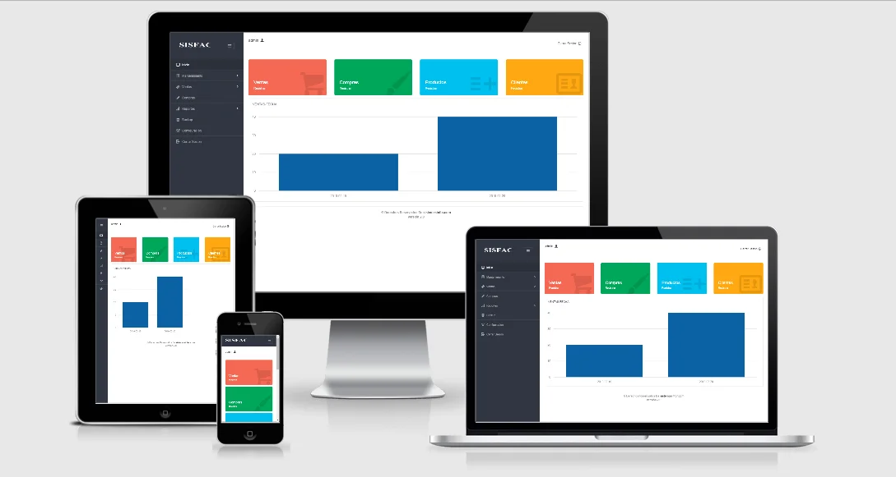

# Junta Vecinal Web 🚀

Sistema informático web diseñado para facilitar la interoperabilidad y mejorar la comunicación entre los vecinos y las municipalidades. Este sistema permite a los presidentes de cada junta vecinal junto con sus secretarios interactuar de manera eficiente con las autoridades locales, agilizando la resolución de problemas, consultas y solicitudes a través de una plataforma accesible y moderna.
